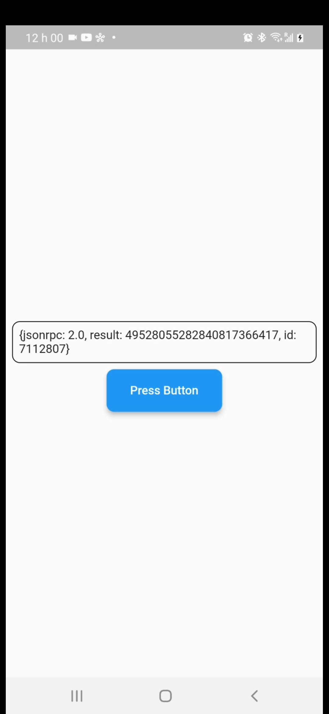

# Flustora

**Flustora, is a package that was developed in dart code for flutter projects. Its purpose is to contain several return functions that can communicate with the Filecoin blockchain.**

*Note*: This package is still under development, and some functionnalities might not be available yet.


[github](https://github.com/flustora/flutter_flustora/tree/main/packages/flustora)

[Update log](https://github.com/flustora/flutter_flustora/blob/main/packages/flustora/CHANGELOG.md)

## **Features**

Flustora, is a package that operates in 2 main Modules such as:
- Wallet, 
- Chain.

## **Usage**

### Add dependency

Please check the latest version before installation.
If there is any problem with the new version, please use the previous version

```yaml
dependencies:
  flutter:
    sdk: flutter
  # add flustora
  flustora: ^{latest version}
```

### Add the following imports to your Dart code

```dart
import import 'package:flustora/flustora.dart';
```

### Initialize the main() function 

```dart
void main() async {
  await initialization();
  runApp(const MyApp());
}
```

## **Examples**

- ### Wallet
  * [x] **getWalletBalance()**
    #### Code
    ```dart
    import 'package:flustora/flustora.dart';

    final answer = await Wallet.getWalletBalance(
        walletAddress: "f2n5bol4tz7kpt7n7vtnr53iozkwh6h6flqbxfrsi",
        );
    ```
    #### Image
    <!-- <video  width="250" controls loop>
    <source src="demo/wallet_balance.mp4" type="video/mp4">
    </video> -->

    

  * [x] **getWalletValidateAddress()**
    #### Code
    ```dart
    import 'package:flustora/flustora.dart';

    final answer = await Wallet.getWalletValidateAddress(
        walletAddress: "f2n5bol4tz7kpt7n7vtnr53iozkwh6h6flqbxfrsi",
        );
    ```
    #### Image
    <!-- <video  width="250" controls loop>
    <source src="demo/wallet_vaidate_address.mp4" type="video/mp4">
    </video> -->
    

  * [x] **getWalletVerfy()**
    #### Code
    ```dart
    import 'package:flustora/flustora.dart';

    final answer = await Wallet.getWalletVerify(
      walletAddress: "f2n5bol4tz7kpt7n7vtnr53iozkwh6h6flqbxfrsi",
      signature: "Ynl0ZSBhcnJheD==",
    );
    ```
    #### Image
    <!-- <video  width="250" controls loop>
    <source src="demo/wallet_verify.mp4" type="video/mp4">
    </video> -->

    
-----

- ### Chain
  * [x] **getChainReadObj()**
    #### Code
    
    ```dart
    import 'package:flustora/flustora.dart';

    final answer = await Chain.getChainReadObj(
      cid: {
        "/": "bafy2bzaceahirpzohp3nj7kl6cpktigcncewjrrvbrzn5wadvxbk6bnzsvxqi"
      },
    );
    ```
    #### Image
    <!-- <video  width="250" controls loop>
    <source src="demo/chain_read_obj.mp4" type="video/mp4">
    </video> -->

    
  * [x] **getChainHead()**
    #### Code
    
    ```dart
    import 'package:flustora/flustora.dart';

    final answer = await Chain.getChainHead();
    ```
    #### Image
    <!-- <video  width="250" controls loop>
    <source src="demo/chain_head.mp4" type="video/mp4">
    </video> -->

    
  * [x] **getChainHasObj()**
    ### Code
    
    ```dart
    import 'package:flustora/flustora.dart';

    final answer = await Chain.getChainHasObj(
      cid: {
        "/": "bafy2bzaceahirpzohp3nj7kl6cpktigcncewjrrvbrzn5wadvxbk6bnzsvxqi"
      },
    );
    ```
    #### Image
    <!-- <video  width="250" controls loop>
    <source src="demo/chain_has_obj.mp4" type="video/mp4">
    </video> -->

    
-----

- ### ETH
  * [x] **getEthAccounts()**
    #### Code
  ```dart
    import 'package:flustora/flustora.dart';
    final answer = await Eth.getEthAccounts();
  ```
    #### Image

    

  * [x] **getEthBlockNumber()**
    #### Code
    
  ```dart
    import 'package:flustora/flustora.dart';
    final answer = await Eth.getEthBlockNumber(); 
  ```
    #### Image

    


  * [x] **getEthGetBlockByNumber()**
    #### Code
    
  ```dart
      import 'package:flustora/flustora.dart';
      final answer = await Eth.getEthGetBlockByNumber(numberBlock: '0x82c9');
  ```
    #### Image

    

## **Packages Used**
* [x] **Dart Dependencies Used**
  - dartz: ^0.10.1
  - equatable: ^2.0.5
  - get_it: ^7.2.0
  - http: ^0.13.5
  - crossplat_objectid: ^3.0.0
  
* [x] **Dart Dev_Dependencies Used**
  - mocktail: ^0.3.0


***
<p style="text-align: center"> Copyright &copy; 2023 Flustora All Rights Reserved</p>